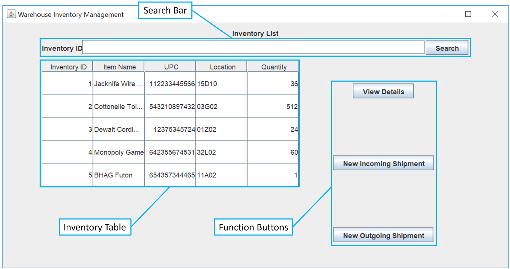
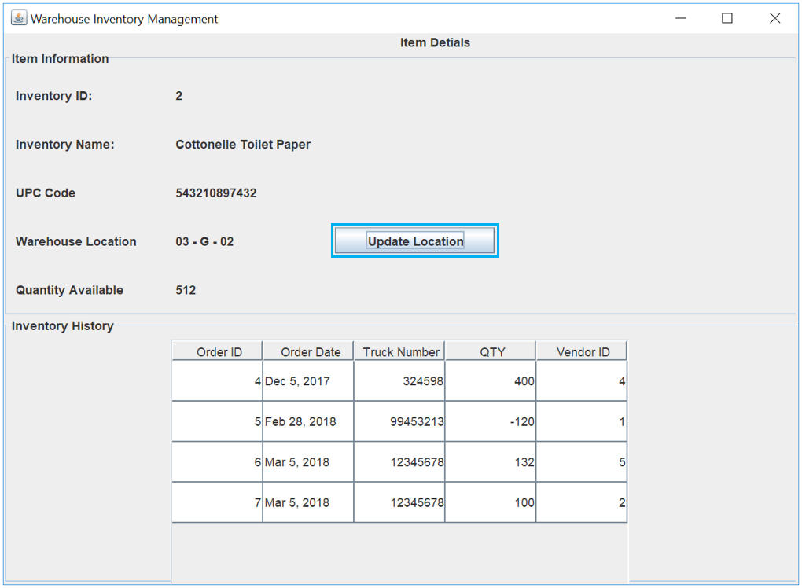

# Warehouse Inventory Management System Capstone Project

Team Members:
David Kirkman, Charles Garnette, Emily Chiou, Eric Bridges

## Overview
The Warehouse Inventory Management (WIM) system is a stand-alone warehouse management package with a user-friendly interface and a stable database foundation. Created to be intuitive, it requires minimal training. Designed with minimal overhead in mind, it can be installed on any modern computer. 


The WIM system allows a user to manage all on-hand inventory and incoming or outgoing orders. 
* It provides a quick, low-impact transition from older spreadsheet or traditional paper record keeping. 
* With a list of all items, their location, and quantity on the main screen, complete inventory oversight is simple. 
	- This list can be sorted at the users request and provides a method for searching for an item. 
* Each item in inventory has a complete details pane which includes the order history of incoming and outgoing shipments, as well as an updatable location to be used when physical warehouse reorganization becomes necessary. 
* Shipments, incoming or outgoing, can be managed from the main screen. 
	- With a simple interface for all shipments, items can be added as incoming or outgoing and have their on-hand quantities adjusted accordingly.


## Prerequisites
```
1. JDK 10 or JRE 8
2. SQL Database

```
## Installation
```
Download Inventory Manager.jar
```
## Usage

Once the executable has been downloaded and run the program will begin searching for the SQL server. 
By default it will be expecting to connect to a server on **localhost at port 1521** wither username **system** and password **123456**. 
If it does not find a server that meets these requirements it will give the user the opportunity to enter in their credentials as shown below:


If an appropriate login is not entered then the user will be met with the following error:


###### Warehouse Inventory Overview
Once the user has logged in properly they will be taken the the main display of the application. This display will show the various items that are currently available in inventory.

This window can be separated into three major sections:
1.	Inventory Table
2.	Search Bar
3.	Function Buttons


###### Inventory Table
When the WIM software is first opened, the Inventory Table will display a list of all items current in inventory. This table can be sorted in ascending or descending order by clicking on any of the headers

###### Search Bar
The search bar can be used to filter the inventory table and show only the item that you are looking for. Search by entering the Inventory ID then clicking the “Search” button. The Inventory Table will update with the results. If there are no results, the table will return blank.

###### Function Buttons
View Details: After selecting an item in the Inventory List, use this button to view its details.
	New Incoming Shipment: Initiates a new incoming shipment.
	New Outgoing Shipment: Initiates a new outgoing shipment.

###### Item Details
The item details screen provides the same five properties as the Inventory List in addition to the item’s history, and an option to update the item’s location.

An item’s history is displayed in the lower half of the window. The history includes an Order ID number, Date, Truck number, Quantity, and Vendor ID number. A positive quantity indicates an incoming shipment, and a negative quantity an outgoing shipment.
To view details for an item in inventory, select it from the list, then click the “View Details” button. The following screen will then appear:


###### Update Location
An item’s location can be updated by adjusting any or all of the drop-down lists to the new location. Once the changes have been made, click the “Submit” button to save and return to the Item Detail screen.

To update an item’s location, click the “Update Location” button in the Item Detail window.


###### Incoming Shipment
To initiate a new Incoming Shipment, click the “New Incoming Shipment” button on the Main Screen. 

Within the New Incoming Shipment window, enter the Order Number, Truck Number, Vendor ID, and select the order date. To add a new item to the order, select its Inventory ID from the Part Number drop down list. 


If the item is not currently in the inventory database, select “Add New”. 
After selecting “Add New” in the New Incoming Shipment window, the New Item window will open. 

Within the New Item window, enter the items Name, UPC, and incoming Quantity. The Location will default to 00-A-00 and can be changed in this window or later in the Item Details window. When complete, click the “Save” button to save the new item and return to the New Incoming Shipment window. 


After adding all items to the new shipment, click “Create Shipment” to add the incoming items to the inventory, save the order, and return to the Main Screen.

###### Outgoing Shipment
To initiate a new Outgoing Shipment, click the “New Outgoing Shipment button on the Main Screen.


Within the New Incoming Shipment window, enter the Order Number, Truck Number, Vendor ID, and select the order date. To add a new item to the order, select its Inventory ID from the Part Number drop down list. After adding all items to the new shipment, click “Create Shipment” to remove the outgoing quantity from inventory, save the order, and return to the Main Screen.


